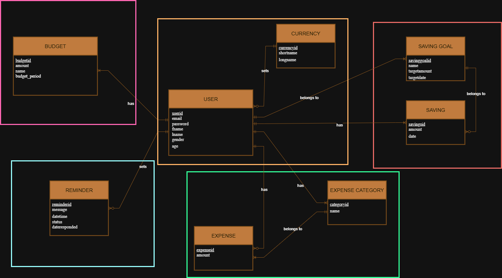

# Takapi


Takapi is a savings app designed to help users manage their money with ease. Its name is a play on the Tagalog word pitaka (wallet), emphasizing its goal of becoming your trusted digital savings app.

This is a Django-based web application. This README provides setup instructions for contributors.

---

## 📦 Requirements
- Python 3.10+
- Virtual environment (recommended: `venv`)
- Database (MySQL)

---

## 🛠️ Setup Instructions

### 1. Clone the Repository
```bash
git clone https://github.com/GReturn/Takapi.git
cd Takapi
```

### 2. Create Virtual Environment
```bash
python -m venv .venv
```

Activate it:
- **Windows (PowerShell):**
  ```bash
  .venv\Scripts\Activate.ps1
  ```
- **Windows (Command Prompt)**
  ```cmd
  .venv\Scripts\activate.bat
  ```
- **macOS/Linux:**
  ```bash
  source .venv/bin/activate
  ```

### 3. Install Dependencies
```bash
pip install -r requirements.txt
```

### 4. Environment Variables
Copy the example environment file:
```bash
cp sample.env .env
```

Edit `.env` and update with your local secrets (e.g. database, secret key, debug mode).

---

## 🔑 Environment Variables

Your `.env` file should look like this:
```env
SECRET_KEY=your-secret-key
DEBUG=True
DB_NAME=takapi
DB_USER=your-username
DB_PASSWORD=your-password
DB_HOST=localhost
DB_PORT=5432
```
Generate your secret key [here](https://djecrety.ir/).
> ⚠️ Never commit `.env` — it contains sensitive information.

---

## 📂 Project Structure
```
Takapi/
│
│── Takapi/           # main Django project
│   ├── settings.py
│   ├── urls.py
│   ├── asgi.py
│   ├── wsgi.py
│
│── apps/             # all apps are stored here
│   │── app1/
│   │── app2/
│   │── app3/
│   │── app4/
│   │── app5/
│
│── static/           # static assets (CSS, JS, images)
│
│── templates/        # HTML templates
│
│── manage.py
│── .env              # local secrets (ignored in git)
│── sample.env
│── requirements.txt
│── README.md
```

---
## 📐 Entity-Relationship Diagram


### Interactive ERD
```mermaid
erDiagram
    USER {
        int user_id PK
        string email
        string password
        string first_name
        string last_name
        string gender
        int age
    }

    BUDGET {
        int budget_id PK
        decimal amount
        string name
        int budget_period
        datetime created_at
    }

    REMINDER {
        int reminder_id PK
        string message
        datetime date_time
        bool status
        string description
        datetime date_responded
    }

    CURRENCY {
        int currency_id PK
        string short_name
        string long_name
    }

    SAVING_GOAL {
        int savinggoalid PK
        string name
        decimal targetamount
        date targetdate
    }

    SAVING {
        int savingid PK
        decimal amount
        date date
    }

    EXPENSE {
        int expense_id PK
        decimal amount
        date date
        string description
    }

    EXPENSE_CATEGORY {
        int category_id PK
        string name
    }

    %% Relationships
    USER ||--|{ BUDGET : has
    USER ||--o{ REMINDER : sets
    USER ||--o{ EXPENSE : has
    USER ||--|{ EXPENSE_CATEGORY : has
    USER ||--|{ SAVING_GOAL : "belongs to"
    USER ||--|{ SAVING : has
    USER }o--|| CURRENCY : sets
    
    SAVING_GOAL ||--o{ SAVING : "belongs to"
    EXPENSE_CATEGORY ||--|{ EXPENSE : "belongs to"
    BUDGET }|--|{ EXPENSE_CATEGORY
```

---

## 🗄️ Database Setup

1. Apply migrations:
   ```bash
   python manage.py migrate
   ```
2. Create a superuser:
   ```bash
   python manage.py createsuperuser
   ```
3. Populate Currency table:
    ```bash
    python manage.py populate_currencies
    ```
---

## ▶️ Running the Server
```bash
python manage.py runserver
```

Visit: [http://127.0.0.1:8000](http://127.0.0.1:8000)

---

## 🧪 Running Tests
```bash
python manage.py test
```

---

## 🌍 Deployment Notes
- Use a production-ready database (e.g. PostgreSQL).
- Set `DEBUG=False` in `.env`.
- Configure `ALLOWED_HOSTS` in `settings.py` using env vars.
- Run:
  ```bash
  python manage.py collectstatic
  ```

---

## 🤝 Contributing
1. Create a feature branch:  
   ```bash
   git checkout -b feature/awesome-feature
   ```
2. Commit changes and push  
3. Open a Pull Request

---
